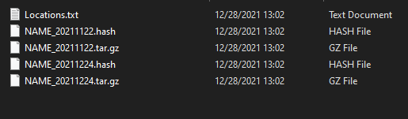
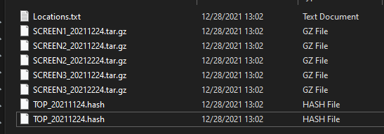

## Purpose:
- This will be my pseudo ideas for my backup scripts project

## Layout
**Idea:**
- Two Scripts will be created, one that will:
  - Backup My PC Productivity Data
- And one that will:
  - Backup my Screenshots

- Both these scripts will do similar things but will function differently, hence why they are separated

**Parts**:
- Main (Will handle arguments, flow of program)
- File Parser (Will open locations files and pull hashes, file locatins, names, etc)
- File Writer (Will write new config file)
- Hasher (Will Hash files and compare to hash list)
- Backup (Will copy and write "new" files to compressed archive)


**Flow:**

```bash

#START 
#Process Arguments 
--> Are they Correct?
#Read Files and populate variables 
--> Can you read locations correclty? 
--> Does backup locations exist? 
--> Does your hash file exist?
#Backup 
--> Build Directory Stucture??? 
-->  Start to go to backup locations and pull files 
--> Calculate file hash, if it exists in master hash file then do not backup 
--> Otherwise backup and push to compressed archive
#Create new master hash file
#Final output will be two files: Master hash file and Compressed backup archive
#END
```

**File Stucture:**

Locations (Stores backup directorys, make sure to use full paths and this is going to be recursive!)
```Bash
DIRECTORY PATH
...
...
...

```

```Bash
C:\Program Files\Data
D:\Backup
```

Hash (Stores hashes of files so that when you backup, old files are not re-backed up!)
```Bash
#Name (Based off of Date/Time) (Archive will be this name as well)
#Chain (One>Two>Three)
FILE HASHES #(Note: New Hashes will be concatinated to end)
...
...

```

```Bash
12282021-0933
12132021-0909>12202021-0743>12282021-0933
2A6D58A2DD2E95CFB6277960F2A7876169E60D2E3B79F90989B72428CAE4F7E3
ADD8A3F3CB46E1D16EFB401BEF8F905A07513E2A870D63CCF6D10EE97FA0CC07
402568AD8A01EDB29446674EE7431AA6281CAB8566DC6D6EE3656CF64CA3509F
81AE51F60ECFCAC7636E8B97CE18805BABDCE17AFB6D76390AC18872B03B71C0
AE82D1BC9F912A40790198C45649BEE6187C0779F12594E428CB1CE0EC4353A9
98E60C7D9C9BDA5A27A0626A774872F2BD5BC6D1484D595B2B9CC51433946378
```

**What I would Like my directories to look like**:

--> Backup Script:



--> ScreenShot Script:




