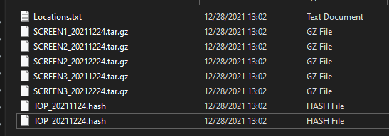

## Purpose: These scripts will perform simple backups.
**This project was created for the want to learn powershell better**
---
**bup.ps1**
- Used for General Backups. Will take specified dirs and tar them while noting previous hashes (if exist). If any files match previous hashes then they will be skipped.
- Can be used to chain multiple backups of the same dirs over time

**sbup.ps1**
- Used to backup dirs that are similar but need to be separated by tag/name
- Good for pictures that have a unique dir based off of time/place/event
- will tar each tag/name category separately so it will be easier to restore
- just like bup.ps1 it will refernce a hash file and skip files that are found in it


## bup.ps1
---
**Usage**
```
./bup.ps1 -locationFile LOCATIONFILE [-hashfile HASHFILE] 
```

Where:

-locationFile: A file that has full paths pointed to dirs that want to be backed up

-hashfile: A csv containing hashes of files that where previously backed up

**Idea**

bup.ps1 will tar all folders specified by LOCATIONFILE (.txt file with one full path per line). It will create a hash file upon completion that will contain sha256 hashes of all files it backs up so that future backups of same directories can skip already backed up files (Note you must specify a HASHFILE in subsequent backups in order for this to work). This was tested on windows but due to tar's nature can proabably work on linux too if powershell is installed.

**Directory Sturcture**

Note: ".hash" should be ".csv"


**Locations file structure**

```
C:\PATH\PATH1\PATH2
E:\PATH\
...
```

**Hash file structure**

```
Hash,Path,Version
COMPUTERNAME,BACKUPCHAIN,
AB368102A7849049...AH3, C:\PATH\file.txt, COMPUTERNAME_DATE
...
```


## sbup.ps1
---
**Usage**
```
./sbup.ps1 -locationFile LOCATIONFILE [-hashfile HASHFILE] 
```
**Idea**

For sbup.ps1 I wanted to catagorize and backup my photos by event or time so that when I wanted to restore, I had one tar per instead of one tar that contained everything. Thus, this script is very similar to bup.ps1 with really the only differnce being in how the locations.txt is configured.

**Directory Sturcture**



**Locations file structure**

```
[CAT_NAME_ONE]
C:\PATH\PATH1\PATH2
E:\PATH\
[CAT_NAME_TWO]
Z:\PATH
[CAT_NAME_THREE]
C:\PATHS\PATH23\
...
```

**Hash file structure**

```
Hash,Path,Version,Set
COMPUTERNAME,BACKUPCHAIN,,
AB368102A7849049...AH3, C:\PATH\file.txt, COMPUTERNAME_DATE, CAT_NAME
...
```

## Tips
---
- If you want to perform a full backup don't include a hashfile
- Always provide the last hashfile gererated for next backup in chain otherwise you might get duplicate file backups
- This script is not very verbose aside output of tar
- Checkout the .csv gernated if you want to track what is being backed up and on what date
- This Scrpit writes your comptuer's hostname as part of the tar's filename
- Remember you never need to create the hashfile, this is aways generated for you

## Issues
---
- I put in some love for backing up on linux but havent tested, but it might work
- Due to tar being a native linux tool, it has issues with drive letters that are found on windows (C:, E:, etc). If you provide full paths for you backup locations it works fine, however if you provide full paths on two separate drives that have the EXACT same dir structure, tar will merge them together instead of keeping them separate by drive. Tar literally trims off the drive letter when it is archiving.
- The efficency of this script is questionable, thus might be slow with very large datasets
- sbup.ps1's code is pretty messy since it was thrown together at the last second
